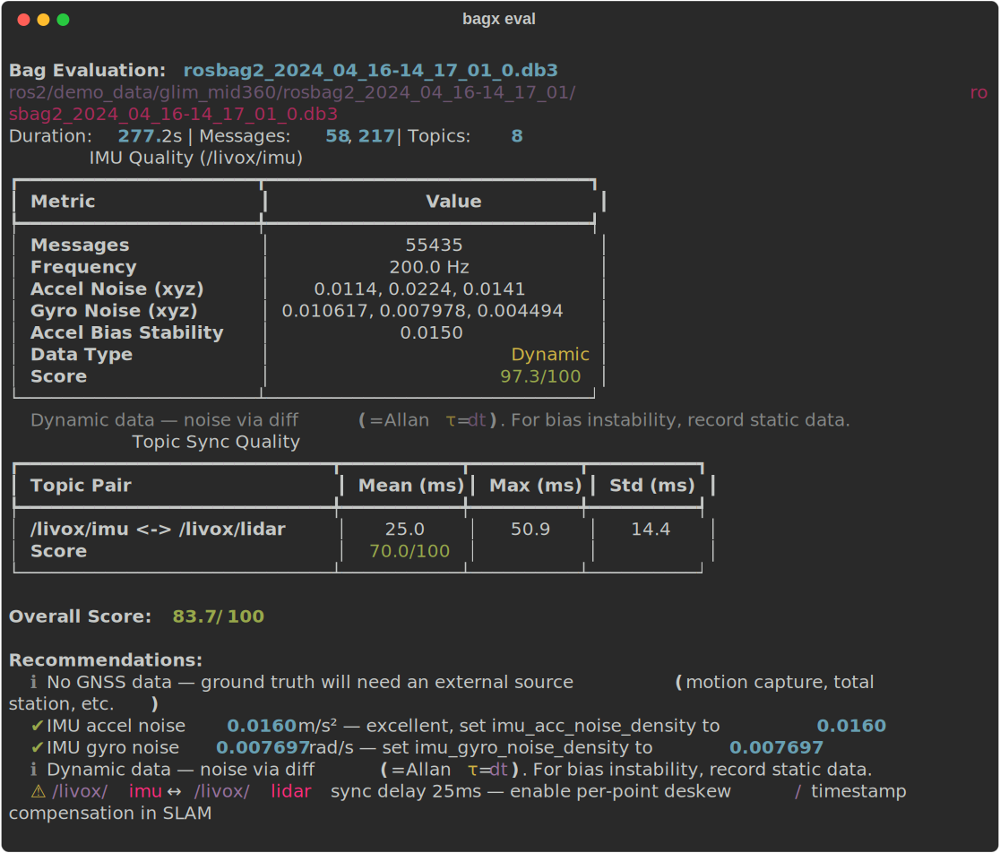

# bagx

[](https://pypi.org/project/bagx/)
[](https://github.com/rsasaki0109/bagx/actions/workflows/ci.yml)
[](https://rsasaki0109.github.io/bagx/)
[](LICENSE)

**One command to tell whether your rosbag is usable — for SLAM, perception, planning, and control.**

```bash
pip install bagx
bagx eval your_bag.db3
```

<p align="center">
  
</p>

bagx analyzes your rosbag and tells you:
- **SLAM readiness**: IMU noise, GNSS quality, LiDAR↔IMU sync, and whether LIO is a bad idea
- **Navigation/control readiness**: odom / scan / costmap rates, goal observability, and `plan → cmd_vel` latency
- **Perception dataset readiness**: RGB / depth / infra rates, camera calibration presence, and reusable export structure
- **Manipulation readiness**: joint-state rate, planner visibility, and `planned_path → arm execution` latency
- **Custom stack support**: user-defined rules on topic names/types/rates/latencies for custom messages
- **Repeatability**: manifest-driven benchmark suites you can rerun across public and private bags

## What bagx answers

When a rosbag is not for SLAM, the value is usually one of these:

- *"Can I trust this bag for navigation debugging?"* → `bagx eval` checks odom, scan, costmap, plan, and control-loop timing
- *"Did my Autoware recording include the sensing and vehicle topics I actually need?"* → bagx verifies camera, LiDAR, GNSS, `/vehicle/status/*`, and whether planning/control topics are present
- *"Is this RGB-D bag usable for perception work, or did I forget camera_info / depth / infra?"* → bagx flags stream rates, calibration topics, and RGB-D coverage
- *"Did MoveIt record just planning, or also execution?"* → bagx checks `joint_states`, action topics, and controller activity
- *"We use custom messages, can bagx still help?"* → `bagx eval --rules rules.json` adds custom domains and checks without needing message decode
- *"Which of these bags should become my regression benchmark?"* → `bagx benchmark` and `bagx batch eval` make that repeatable

## Example: catching a real problem

```
$ bagx eval ouster_os0-32.db3

Overall Score: 76.6/100

Recommendations:
  ✔ IMU accel noise 0.087 m/s² — good for LIO, set imu_acc_noise_density to 0.087
  ⚠ IMU gyro noise 0.022 rad/s — consider lowering IMU integration weight
  ⚠ IMU rate 50Hz is low — 200Hz+ recommended for tightly-coupled LIO
  ⚠ LiDAR↔IMU sync delay 23ms — enable per-point deskew in SLAM
```

Without bagx, you'd discover these issues *after* hours of failed SLAM runs.

For non-SLAM bags, the same workflow answers different questions:

```
$ bagx eval nav2_robot.db3

Recommendations:
  Nav2 topics detected
    ✔ Odometry (/robot/odom) at 50Hz — good for Nav2
    ✔ LaserScan (/robot/scan) at 12Hz — good for costmap
    ✔ Pipeline plan → cmd_vel onset: 11ms median, 76ms P95 (3 samples)

$ bagx eval r2b_galileo2

Recommendations:
  Perception topics detected
    ✔ Depth image (/camera/realsense_splitter_node/output/depth) at 30Hz — good for RGB-D perception
    ✔ Infra stereo streams are both recorded — depth debugging is possible
    ✔ Camera calibration topics are recorded — exported perception data is reusable
```

## Install

```bash
pip install bagx
```

Works **without ROS2** — reads `.db3` files directly via SQLite.

## Commands

| Command | One-liner |
|---------|-----------|
| `bagx eval bag.db3` | Is this bag ready? Auto-detects SLAM / Nav2 / Autoware / MoveIt / Perception / Control |
| `bagx compare A.db3 B.db3` | Which sensor config is better? |
| `bagx sync bag.db3 /imu /lidar` | Are my sensors synchronized? |
| `bagx anomaly bag.db3` | Where did sensor quality drop? |
| `bagx scenario bag.db3` | Find GNSS-lost and high-dynamics segments |
| `bagx export bag.db3 --ai` | Export to Parquet/JSON for ML |
| `bagx batch eval *.db3 --csv` | Rank an entire dataset |
| `bagx ask bag.db3 "question"` | Ask questions via LLM |
| `bagx benchmark suite.json` | Re-run a curated benchmark suite and fail CI on regressions |
| `bagx eval bag.db3 --rules rules.json` | Apply custom topic/type/rate/latency rules for your stack |

## Representative results

| Dataset | Domain | Score | What bagx tells you |
|---------|--------|-------|---------------------|
| Newer College | SLAM | **92** | LiDAR+IMU quality is strong enough for SLAM benchmarking |
| Ouster OS0-32 | SLAM | **77** | IMU is too slow and sync is weak, so deskew / sensor changes are needed |
| `driving_20_kmh_2022_06_10-16_01_55_compressed` | Autoware sensing/control | **99** | LiDAR packets and `/vehicle/status/velocity_status` are present and healthy |
| `r2b_galileo` | Multi-camera perception | **90.5** | Eight compressed camera streams, IMU, and chassis odom are recorded and time-aligned |
| `r2b_galileo2` | Camera perception | **97.5** | RGB-D + infra + camera_info are all recorded, so the bag is reusable for perception work |
| `r2b_robotarm` | Manipulation perception | **96.0** | RGB-D + `joint_states` make it suitable for robot-arm perception benchmarking |
| `nav2-deep-final-20260324-185315` | Navigation/control | **100** | Nav2 plan, costmap, and `plan → cmd_vel` loop are all observable |
| `moveit-exec-final-20260324-185315` | Motion planning/control | **100** | MoveIt planning and arm execution are both recorded end-to-end |

## Auto-detects your framework

bagx recognizes topic patterns and gives framework-specific advice:

Namespaced topics are supported too, so real bags like `/robot/odom`,
`/sensing/lidar/top/pointcloud_raw_ex`, or `/move_group/display_planned_path`
are detected without renaming topics first.

```
$ bagx eval nav2_robot.db3
Nav2 topics detected
  ✔ Odometry (/robot/odom) at 50Hz — good for Nav2
  ✔ LaserScan (/robot/scan) at 12Hz — good for costmap
  ✔ Global plan (/plan) recorded 3 times — planner output is visible
  ✔ NavigateToPose status (/navigate_to_pose/_action/status) recorded
  ✔ Pipeline scan → cmd_vel (full loop): 41ms median, 81ms P95
  ✔ Pipeline plan → cmd_vel onset: 11ms median, 76ms P95 (3 samples)

$ bagx eval autoware_vehicle.db3
Autoware topics detected
  ✔ LiDAR (/sensing/lidar/top/pointcloud_raw_ex) at 10Hz
  ✔ Camera (/sensing/camera/front/image_raw/compressed) at 30Hz
  ✔ GNSS (/sensing/gnss/ublox/nav_sat_fix)
  ℹ Sensing/localization-only Autoware bag — skipping planning/control checks

$ bagx eval moveit_arm.db3
MoveIt topics detected
  ✔ JointState (/joint_states) at 115Hz — good for motion planning
  ✔ MoveGroup action activity recorded on /move_action/_action/status
  ✔ Joint trajectory controller activity recorded on /panda_arm_controller/follow_joint_trajectory/_action/status
  ✔ Pipeline joint_states → planned_path: 6ms median, 6ms P95 (1 sample)
  ✔ Pipeline planned_path → arm execution: 5ms median, 5ms P95 (1 sample)

$ bagx eval r2b_galileo2
Perception topics detected
  ✔ RGB image (/camera/color/image_raw) at 15Hz — good for camera-based perception
  ✔ Depth image (/camera/realsense_splitter_node/output/depth) at 30Hz — good for RGB-D perception
  ✔ Infra stereo streams are both recorded — depth debugging is possible
  ✔ Camera calibration topics are recorded — exported perception data is reusable

$ bagx eval control_loop.db3
Planning/control topics detected
  ✔ State feedback (/base/state/odom) at 25Hz — good for closed-loop control
  ✔ Control command (/drive/cmd_vel) at 20Hz — good for control-loop observability
  ✔ Planner output (/planner/path) recorded 6 times — upstream planning is visible
  ✔ Pipeline planner → command onset: 15ms median, 15ms P95

$ bagx eval warehouse_bag.db3 --rules examples/custom_rules/warehouse_bot.json
WarehouseBot custom rules matched
  ✔ Wheel odometry (/warehouse_bot/wheel_odom) at 50Hz — custom rule satisfied
  ✔ Controller command (/warehouse_bot/controller_cmd) at 25Hz — custom rule satisfied
  ✔ Mission result (/warehouse_bot/mission/result) recorded — custom rule matched
  ✔ Pipeline mission path → controller: 10ms median, 10ms P95
```

## Dogfooding

bagx is dogfooded against:

- Autoware real bags, including the official `all-sensors-bag4` dataset from the Autoware documentation datasets page
- Nav2 simulator bags captured with `scripts/run_ros_dogfood.py nav2-gazebo`
- MoveIt simulator bags captured with `scripts/run_ros_dogfood.py moveit-demo`

Recent dogfood runs:

- `nav2-deep-final-20260324-185315`: `Overall 100.0/100`, `LaserScan 13Hz`, `plan → cmd_vel onset 11ms median`
- `moveit-exec-final-20260324-185315`: `Overall 100.0/100`, `JointState 115Hz`, `planned_path → arm execution 5ms median`
- `autoware_isuzu_all_sensors_bag4`: real bag, `Overall 72.2/100`, plus a sensing-only note when planning/control topics are absent
- `driving_20_kmh_2022_06_10-16_01_55_compressed`: official Autoware open-data bag, `Overall 99.0/100`, LiDAR packet sync and `/vehicle/status/velocity_status` captured
- `r2b_galileo`: official NVIDIA open-data MCAP, `Overall 90.5/100`, eight compressed camera streams plus IMU and chassis odom
- `r2b_robotarm`: official NVIDIA open-data MCAP, `Overall 96.0/100`, RGB-D + joint-state manipulation perception checks
- `r2b_galileo2`: official NVIDIA open-data MCAP, `Overall 95.3/100`, camera-only RGB-D perception checks without SLAM-specific false advice

## Benchmark suites

`bagx` now supports manifest-driven benchmark suites so public bags can become repeatable regression tests instead of one-off dogfood runs.

The repository includes [benchmarks/open_data_suite.json](/workspace/ai_coding_ws/bagx/benchmarks/open_data_suite.json), which covers:

- Autoware official `all-sensors-bag4`
- Autoware official `driving_20_kmh_2022_06_10-16_01_55_compressed`
- NVIDIA official `r2b_robotarm`
- NVIDIA official `r2b_galileo`
- NVIDIA official `r2b_galileo2`

It also includes [benchmarks/non_slam_suite.json](/workspace/ai_coding_ws/bagx/benchmarks/non_slam_suite.json), which focuses on non-SLAM value:

- NVIDIA official `r2b_galileo2` camera-only perception
- NVIDIA official `r2b_robotarm` manipulation perception
- Local Nav2 dogfood bags under `.cache/dogfood/`
- Local MoveIt dogfood bags under `.cache/dogfood/`

Typical usage:

```bash
export BAGX_REALBAGS=/tmp/bagx_realbags
bagx benchmark benchmarks/open_data_suite.json
bagx benchmark benchmarks/open_data_suite.json --json benchmark-report.json
bagx benchmark benchmarks/non_slam_suite.json
bagx eval my_custom_stack.db3 --rules examples/custom_rules/warehouse_bot.json
```

JSON outputs now include `schema_version`, `report_type`, and `bagx_version`, so they are easier to gate in CI and compare across releases.

Typical local workflow:

```bash
# Assumes the ROS overlay is already installed at .cache/ros_overlay_nav2_test
python3 scripts/run_ros_dogfood.py nav2-gazebo \
  --duration 40 \
  --record-dir .cache/dogfood/nav2-deep-final
bagx eval .cache/dogfood/nav2-deep-final

python3 scripts/run_ros_dogfood.py moveit-demo \
  --duration 40 \
  --record-dir .cache/dogfood/moveit-exec-final
bagx eval .cache/dogfood/moveit-exec-final
```

## Links

- [Documentation](https://rsasaki0109.github.io/bagx/)
- [PyPI](https://pypi.org/project/bagx/)
- [Changelog](https://github.com/rsasaki0109/bagx/releases)
